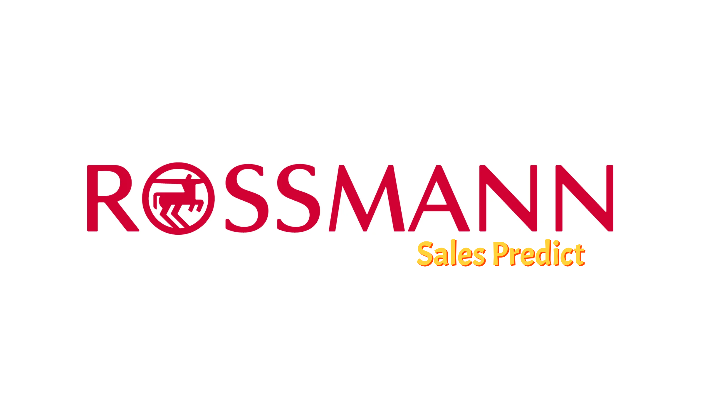
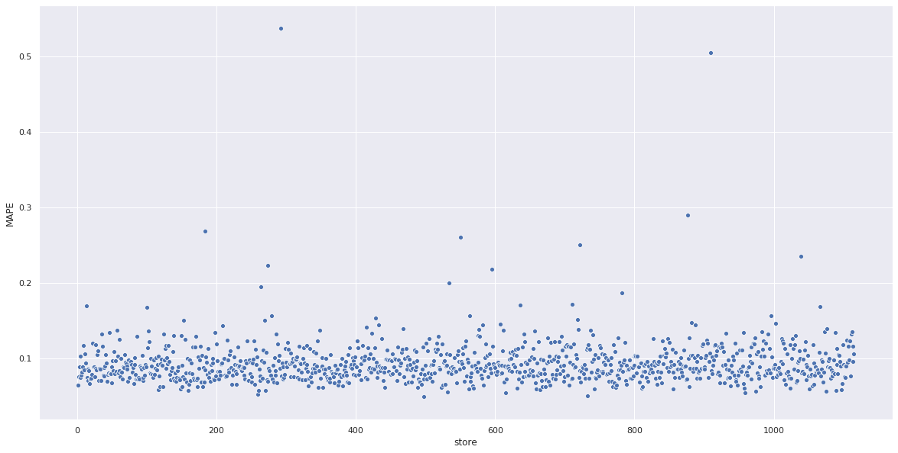
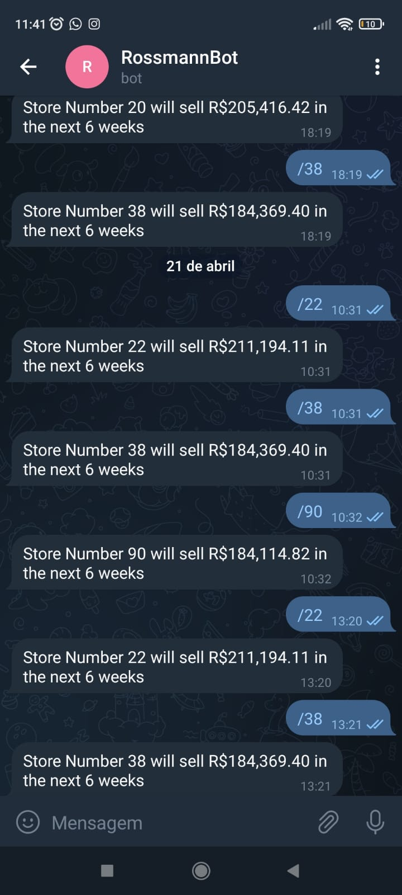

<h1>
<b>Data Science Project - Rossmann Sales Predict</b>
</h1>

> Status: Developing by Versions (Version 1). Finish ✅

<i>This Insights Project was developed that me and taught of the CommunityDS</i>

 

# 1 - Business Problem

**Description**: *"Rossmann is a company that operates over 3,000 drugstores in 7 European countries. Currently, Rossmann's store managers are tasked with forecasting their sales for the next 6 weeks. Store sales are influenced by many factors, including promotions, competition, school and state holidays, seasonality and location. With thousands of individual managers predicting sales based on their unique circumstances, the accuracy of results can vary greatly."*

**Objective**: Centralize sales forecasts for the next 6 weeks so that results are consistent.

 

# 2 - Business Assumptions
All data was taken from the company's internal sales base for the last 30 months.
Various details were provided, such as type of store, variety of products offered and proximity to the competition. Other variable information such as customers per day and sales per day, holidays, marketing promotions were also available.

However, it is necessary to assume some behaviors to solve the problem:

- **Conmpetition Distance**: It was expressed in meters, but in some records it was zero. Therefore, 'Zero Competition Distance' was the same as 'No Competition Proximity'. But for ML algorithms, this input is a bias. In this case, I assumed a fixed value (200,000 m) higher than the highest value in the dataset.
- **Assortment**: I assumed that there is a hierarchy between the types. Thus, stores with Type C Assortment must also offer Types A and B.
- **Store Open**: I removed all the lines that indicate Closed Store, as we also had zero sales on the same day.
- **Sales Prediction**: According to the CFO, I assumed they would provide the total sales for each store at the end of the sixth week.

 

# 3 - Solution Strategy

My strategic steps to solve the business problem at hand were:

1) **Problem Understanding and Solution Planning**: The most crucial step to correctly planning the entire solution.

2) **Data Description**: Use of statistical metrics to identify data outside the scope of the business.

3) **Data Filtering**: Rows filtering and columns selecting that do not contain information for modeling or that do not correspond to the scope of the business.

4) **Feature Engineering**:  New attributes derived based on the original variables to better describe the phenomenon to be modeled.

5) **Exploratory Data Analysis**: Data exploration to find insights and better understand the impact of variables on model learning.

6) **Data Preparation**: Data preparation so that Machine Learning models can learn the specific behavior.

7) **Selection of Features**: Selection of the most significant attributes for training the model.

8) **Machine Learning Modeling and Cross-Validation**: Machine Learning Model Training and Cross-Validation to acquire the Performance Real the Model.

9) **Fine-Tuning of Hyperparameters**: Choose the best values ​​for each of the parameters of the model selected in the previous step.

10) **Convert Model Performance into Business Values**: Convert Machine Learning model performance into a business outcome.

11) **Deploy the Model to Production**: Model publishing to a cloud environment so that other people or services can use the results to improve their business decision. In this specific case, the model can be accessed from a Telegram Bot.

 

# 4 - ML and Metrics

In the Machine Learning stage, 4 Machine Learning Algorithms were tested: Linear Regression, Lasso Regression, Random Forest Regressor and an XGBoost Regressor. The metrics applied to measure the performance of the algorithms were MAE, MAPE and RMSE.

|       Model Name          |        MAE CV       |    MAPE CV    |      RMSE CV       |
|:-------------------------:|:-------------------:|:-------------:|:------------------:|
| Random Forest Regressor   |  837.68  +/- 219.1  | 0.12 +/- 0.02 | 1256.08 +/- 320.36 |
| XGBoost Regressor         |  1030.28 +/- 167.19 | 0.14 +/- 0.02 | 1478.26 +/- 229.79 |
| Linear Regressor          |  2081.7  +/- 295.63 | 0.3  +/- 0.02 | 2852.52 +/- 468.37 |
| Lasso                     |  2116.38 +/- 341.5  | 0.29 +/- 0.02 | 3057.75 +/- 504.26 |

My final model choice was XGBoost as the model will be allocated on free cloud storage system (Heroku) which has a storage limit, XGBoost is a model that has a low RMSE value and is lighter than Random Forest.

The metric problems can be solved in "Hyperparameter Fine Tuning" step. 
Look the metrics after a better choice of parameters to train the model:

|    Model Name        |     MAE      |    MAPE    |     RMSE       |
|:--------------------:|:------------:|:----------:|:--------------:|
|  XGBoost Regressor   |   640.242    |    0.093   |    927.211     |

<i>P.S. RMSE better than Random Forest!</i>

 

# 5 - Business Results

The table below show the total of predictions. Considering the best and worst real scenarios:

|   Scenario     |      Values      |
|:--------------:|:----------------:|
| predictions    | $ 283,636,608.00 |
| worst_scenario | $ 257,525,527.23 |
| best_scenario  | $ 309,747,687.23 |

Below we have a Scatter Plot with all the predictions. Notice that most are centered around a line parallel to the X axis (MAPE 9,3% in Y axis). However, there are points quite far apart. This is because there are stores for which the forecasts are not so accurate, while others are very assertive.

 

# 6 - Telegram Bot.

 

# 7 - Lessons Learned

- Problem and Regression Metrics
- Data Preparation
- Cross-Validation
- Hyperparameter Fine Tuning
- API creation and request
- Bot creation on Telegram

 

# 8 - In the next cycle?

- Better plots;
- More tests in ML algoritms;
- Build a pipeline to retrain model.

Thank you!

Rodrigo Rangel

