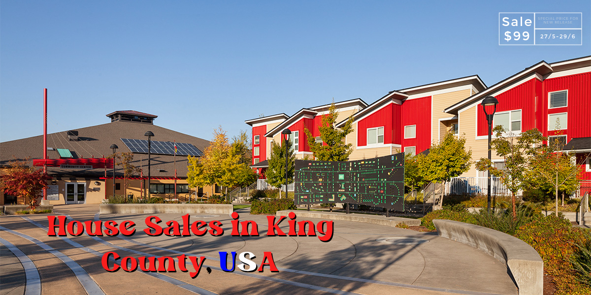

<h1>
<b>Insight Project - King County House Sales Insights</b>
</h1>

> Status: Developing by cicles (Version 2). Finish ✅

<i>This Insights Project was developed that me and taught of the CommunityDS</i>

# 1 - Business Problem
This project searches to find the best opportunities to acquire (inside of available portfolio) properties in King County (USA) for maximizing the gain of House Rocket company, through the data analysis.

## 1.1  - Business Questions 
The project tries to answer the best way, two business questions:

**1)** How many properties should House Rocket buy?

**2)** One time the properties were purchased, which was the best moment to sell them, and at which price?

**3)** This project searches also to validate 10 hypothesis through the data exploratory analysis:

- **H1:** Properties that have a view of the water are 100% or more expensive, on average than properties that do not have a view of the water;
- **H2:** Propeties that have good view of the water are 80% or more expensive, on average than properties that do not have a good view of the water;
- **H3:** Properties built before 1955 is 50% cheaper, on average than properties built after 1955;
- **H4:** Properties without a basement have 50% larger land area than properties with a basement;
- **H5:** The crease YoY of the properties price is the 10%;
- **H6:** Properties with 3 bathroom have a average crease MoM is the 15%;
- **H7:** Renovated properties are 15% or more expensive in relation to the average price of all properties;
- **H8:** Properties with more the 3 bedrooms are 20% or more expensive in relation to the average price of all properties;
- **H9:** Properties with good condition are 15% or more expensive in relation to the averege price of all properties;
- **H10:** Properties with 2 or more floors are 15% more expensive than properties with less than 2 floors;

# 2 - Solution Strategy
My strategical steps to solve the business problem in question was be:

1) **Business Understanding**

2) **Solution Planning**

3) **Data Collect**

4) **Data Description**

5) **Data Cleaning and Data Transformation**

6) **Exploratory Data Analysis**

P.S. _The project data approach is contained in the notebook_

## 2.1 - Versions
- **1st Version**: 1 notebook with development of the entire solution to the problem in a linear fashion.
- **2nd Version**: 1 script organized into functions and printed on the console for easy observation (more academic approach) and 1 application folder created for viewing the dashboard on Streamlit with their respective files for your operation.

 

# 3 - Business Results
**1 e 2) Business Questions:**
The results of the business questions are explicit in two dataframes, (1) properties_to_be_purchased.csv and (2) gain_from_sale_of_properties.csv. In these dataframes we have all the properties that are perfect to buy and for which values they could be sold, with the available gain.

**3) Hypothesis Validation:**

**H1: True** 
> Properties that have water view are 162.71% more expensive, on average, than those do not have water view.

**H2: True** 
> Properties that have good water view are 212.42% more expensive, on average, than those do not have good water view.

**H3: False** 
> Properties with date built before 1955 are less the 1% more cheaper, on average, than those with date built after 1955.

**H4: False** 
> Properties without a basement have a land area 21.75% larger than those with a basement.

**H5: False**
> Year-over-year property price growth is 0.7%.

**H6: False**
> Properties with 3 bathrooms had an average MoM (month to month) decrease of 1.14%.

**H7: True**
> Renovated properties are 40.92% or more expensive compared to the average price of all properties.

**H8: True**
> Properties with more than 3 bedrooms are 24.23% more expensive compared to the average price of all properties.

**H9: False**
> Properties in good condition are 13.15% more expensive compared to the average price of all properties.

**H10: False**
> Properties with more than 2 floors are 41.69% more expensive than properties with less than 2 floors.

 

# 4 - Lessons Learned
  * Solution Planning;
  * Exploratory Data Analysis with pandas_profiling;
  * Outliers treatment;
  * Hypothesis validation;
  * Data Integration (ETL);
  * Data visualization using Streamlit;
  * Cloud Application [Heroku];

 

# 5 - Business Results
If the company buys and sells the properties shown in the response dataframes, the <b>profit</b> will be <b>R$5.477.321,74.</b>
